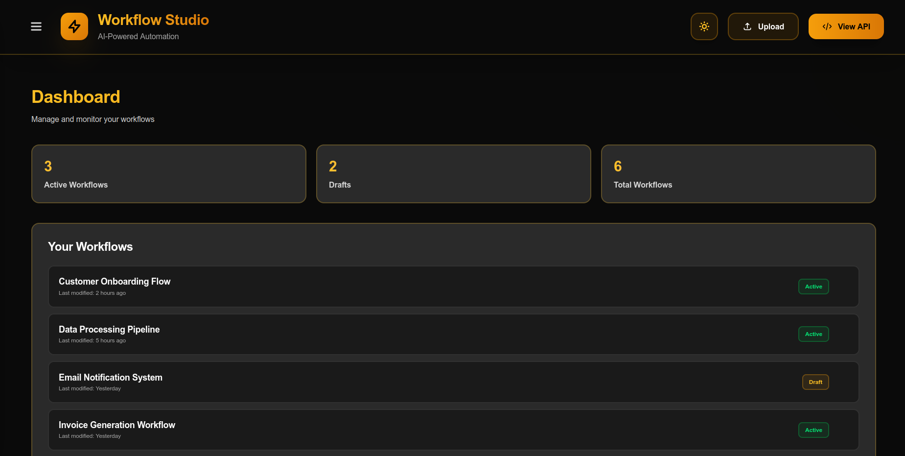
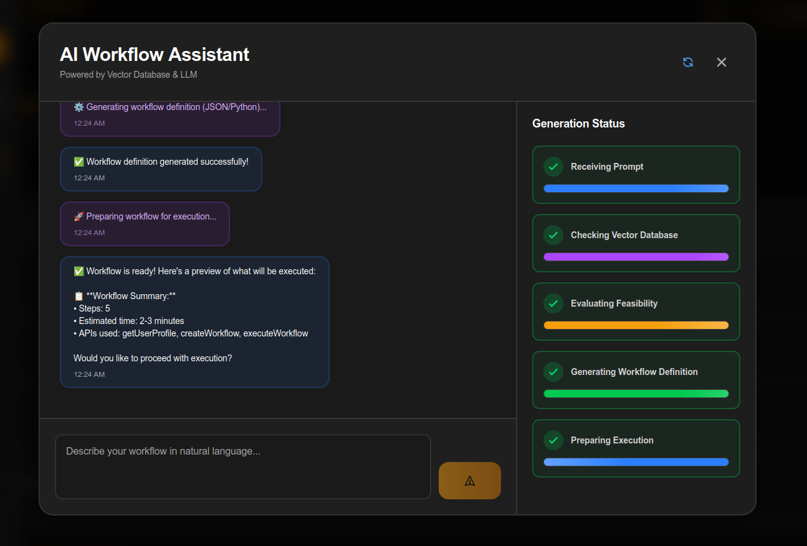
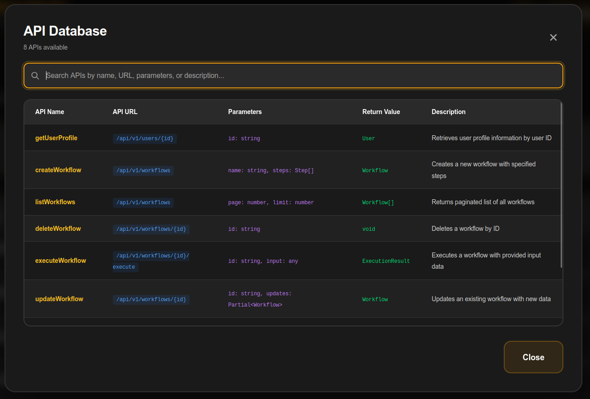
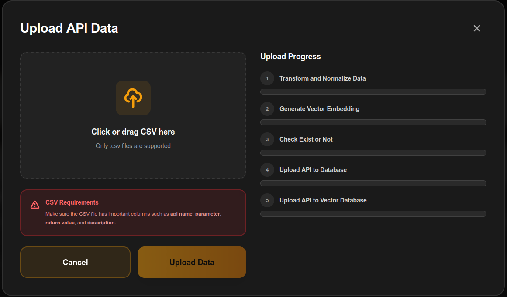
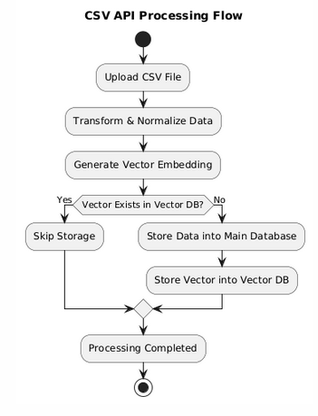
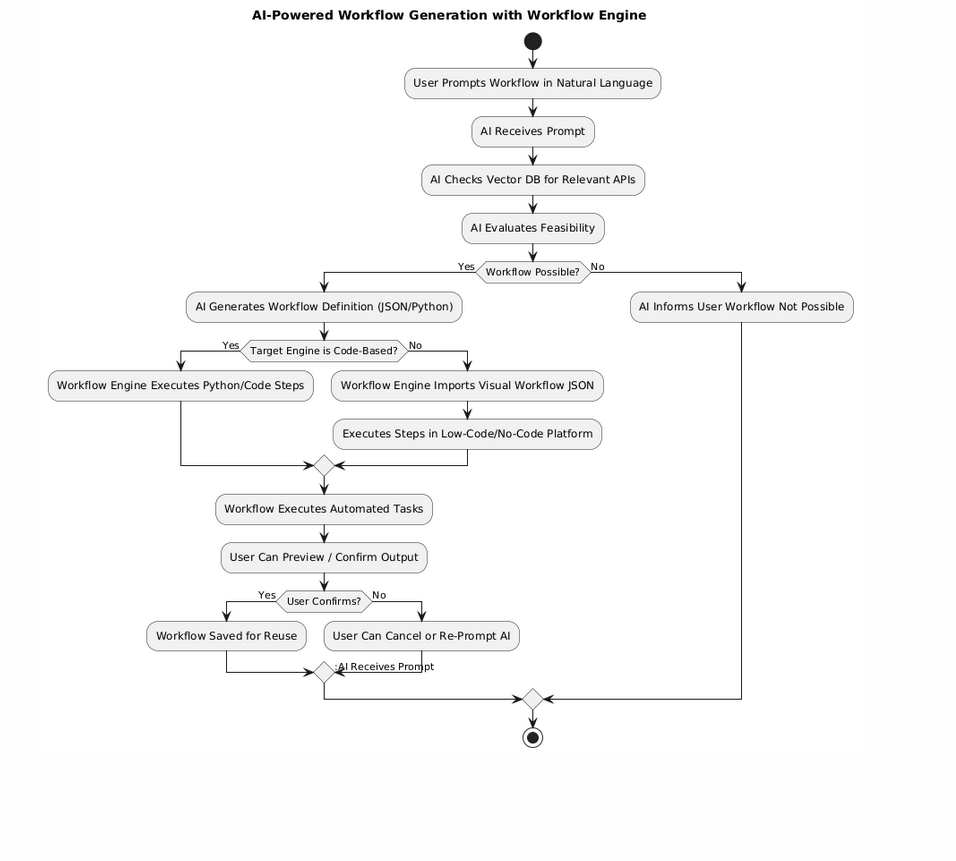

# Workflow Studio: AI-Powered Automation Engine

Workflow Studio is a premium fullstack platform designed to bridge natural language prompts and automated technical workflows. It leverages Vector Databases and LLMs to understand user intent and execute complex API-driven tasks.

---

## System Preview

### Core Interfaces
| Dashboard | AI Chatbot |
|-----------|------------|
|  |  |

| API Management | Upload System |
|----------------|---------------|
|  |  |

---

## System Purpose & Flow

The system is built around two primary engines that work in tandem to provide a seamless automation experience.

### 1. API Knowledge Ingestion (CSV Processing)
This engine handles the "education" of the AI. By uploading CSV files containing API specifications, the system builds a semantic map of available tools.



- **Upload & Normalize**: Raw CSV data is transformed into a standardized format.
- **Vector Transformation**: Each API is converted into a high-dimensional vector using embedding models.
- **Duplicate Detection**: The system checks the Vector DB to ensure no redundant data is stored.
- **Dual Storage**: APIs are stored in a relational database for management and a Vector DB for semantic searching.

### 2. AI-Powered Workflow Generation
Once the system "knows" your APIs, users can simply describe what they want to achieve.



- **Natural Language Input**: Users interact via the AI Chatbot interface.
- **Semantic Search**: The AI queries the Vector DB to find the most relevant APIs for the task.
- **Feasibility Evaluation**: The system determines if the requested workflow can be constructed from available APIs.
- **Code/Visual Generation**: Flows are generated as JSON (for low-code engines) or Python (for direct execution).
- **Execution & Confirmation**: The Workflow Engine executes the tasks, providing the user with results for final confirmation.

---

## Tech Stack

<div align="center">

### Frontend


**Vite** + **React** + **TypeScript**

Lightning-fast development with hot module replacement

---

### Backend


**FastAPI** + **Python 3.12**

High-performance async API with AI/ML integration capabilities

---

### Database & Search


**MySQL 8.0** + **Vector Database (Qdrant/Chroma)**

Reliable storage meets advanced semantic search

---

### DevOps


**Docker** + **Docker Compose**

Containerized development and deployment

</div>

## Features

-  **AI Chat Interface** - Generate workflows using natural language
-  **Semantic API Search** - Vector-based discovery of available tools
-  **Staged Processing** - Visual feedback for background AI tasks
-  **Fullstack Docker** - Seamless "it works on my machine" experience
-  **Enterprise Ready** - Integrated health checks and type safety

##  Quick Start

### Prerequisites

- Docker Engine 20.10+
- Docker Compose V2
- 4GB RAM available

### Setup & Run

```bash
# Clone the repository
git clone <your-repo-url>
cd fullstack-setup

# Create environment file
cp .env.example .env

# Start all services
docker-compose up -d
```

### Access Services

| Service | URL | Description |
|---------|-----|-------------|
|  Frontend | http://localhost:5173 | React application |
|  Backend API | http://localhost:8000 | FastAPI server |
|  API Docs | http://localhost:8000/docs | Interactive API documentation |

##  Project Structure

```
fullstack-setup/
├──  docker-compose.yml      # Service orchestration
├──  .env.example            # Environment template
├──  docs/
│   ├── images/                # Screenshots and flowcharts
│   └── DOCKER_GUIDE.md        # Complete Docker documentation
├──  fastapi-app/            # Backend service
└──  vite-app/               # Frontend service
```

##  Support

For issues and questions:
- Check the [Docker Guide](docs/DOCKER_GUIDE.md)
- Verify service health: `docker-compose ps`

---

<div align="center">

**Built with determination for AI-Driven Automation**

⭐ Star this repo if you find it helpful!

</div>
